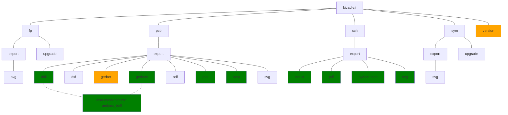

# generate-kicad-files
The schematic and PCB export action for KiCad project.

## Possible kicad-cli commands

```mermaid
flowchart TD;
    main[kicad-cli]
    
    sub1[fp]
    sub1-1[export]
    sub1-1-1[svg]
    sub1-2[upgrade]
    
    sub2[pcb]
    sub2-1[export]
    sub2-1-1[drill]
    sub2-1-2[dxf]
    sub2-1-3[gerber]
    sub2-1-4[gerbers]
    sub2-1-5[pdf]
    sub2-1-6[pos]
    sub2-1-7[step]
    sub2-1-8[svg]
    
    sub3[sch]
    sub3-1[export]
    sub3-1-1[netlist]
    sub3-1-2[pdf]
    sub3-1-3[python-bom]
    sub3-1-4[svg]
    
    sub4[sym]
    sub4-1[export]
    sub4-1-1[svg]
    sub4-2[upgrade]

    sub5[version]

    style sub2-1-1 fill:green
    style sub2-1-3 fill:orange
    style sub2-1-4 fill:green
    style sub2-1-6 fill:green
    style sub2-1-7 fill:green
    style gerber_drill fill:green

    style sub3-1-1 fill:green
    style sub3-1-2 fill:green
    style sub3-1-3 fill:green
    style sub3-1-4 fill:green
    style sub5 fill:orange

    main --- sub1 & sub2 & sub3 & sub4 & sub5
    
    sub1 --- sub1-1 & sub1-2
    sub1-1 --- sub1-1-1
    
    sub2 --- sub2-1 --- sub2-1-1 & sub2-1-2 & sub2-1-3 & sub2-1-4 & sub2-1-5 & sub2-1-6 & sub2-1-7 & sub2-1-8

    sub2-1-1 & sub2-1-4 -.- gerber_drill["also combined into gerbers_drill"]

    sub3 --- sub3-1 --- sub3-1-1 & sub3-1-2 & sub3-1-3 & sub3-1-4

    sub4 --- sub4-1 & sub4-2
    sub4-1 --- sub4-1-1
```

```mermaid
flowchart LR;
    implemented[implemented]
    na[not applicable]

    style implemented fill:green
    style na fill:orange

    implemented ~~~ na
```